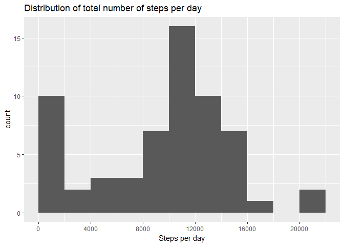
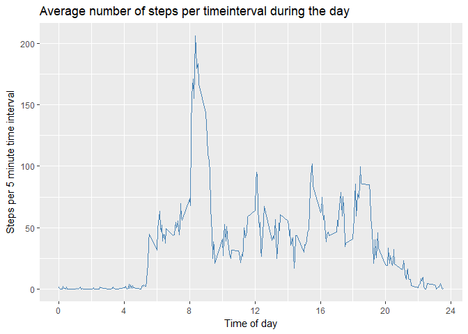
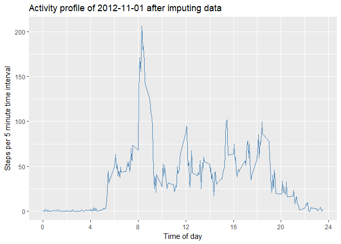
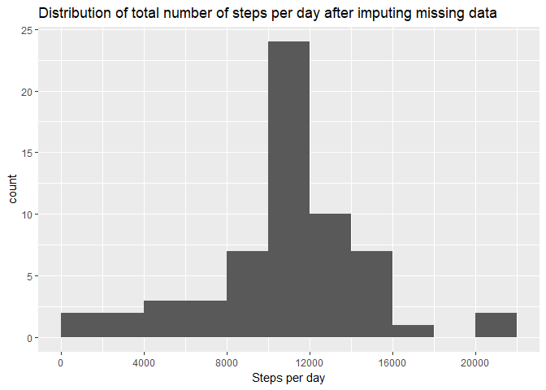
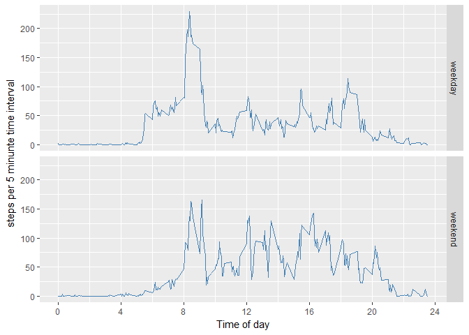

**Used libraries**

```r
library(ggplot2)
library(lubridate)
```

```
## 
## Attaching package: 'lubridate'
```

```
## The following object is masked from 'package:base':
## 
##     date
```

## Loading and preprocessing the data


```r
if(!file.exists("activity.csv")) {
        fn <- "https://d396qusza40orc.cloudfront.net/repdata%2Fdata%2Factivity.zip"
        download.file(fn, "activity.zip")
        unzip("activity.zip")
}
act <- read.csv("activity.csv", stringsAsFactors = FALSE)

#replace date by regular date type
act$date <- ymd(act$date, quiet = TRUE)
```
## Mean total number of steps taken per day


```r
stepsPerDay <- aggregate(act$steps, by=list(date=act$date), FUN = sum, na.rm=TRUE)

ggplot(stepsPerDay) + 
        geom_histogram(aes(x), binwidth = 2000, center = 1000) +
        scale_x_continuous(name = "Steps per day",
                           breaks = seq(0, 24000, 4000)) +
        ggtitle("Distribution of total number of steps per day")
```

<!-- -->

The peak in the first bin (0 to 2000 steps) is caused by missing data in the data set. The mean of the number of steps per day is 9354.2 and the median is 10395. This is off course lower than in reality because of the missing data.

## Average daily activity pattern


```r
stepsPerInterval <- aggregate(act$steps, by=list(interval=act$interval), FUN = mean, na.rm=TRUE)
peakSteps <- max(stepsPerInterval$x)
peakInterval <- stepsPerInterval$interval[stepsPerInterval$x==peakSteps]

ggplot(stepsPerInterval) + 
        geom_line(aes(interval/100,x), col = "steelblue") +
        scale_x_continuous(name = "Time of day",
                           breaks = seq(0, 24, 4)) +
        labs(y = "Steps per 5 minute time interval",
             title = "Average number of steps per timeinterval during the day")
```

<!-- -->

The average amount of steps per time interval peaks at 206.2 at 8:35 hours.

## Imputing missing values


```r
missing.data <- sum(is.na(act$steps))
dates.with.missing.data <- unique(act$date[is.na(act$steps)])
```

Of the 17,568 measurements 2304 are missing on the following 8 dates:  
2012-10-01, 2012-10-08, 2012-11-01, 2012-11-04, 2012-11-09, 2012-11-10, 2012-11-14, 2012-11-30  


```r
act.i <- act
for (i in 1:length(act.i$steps)){
        if (is.na(act.i$steps[i])){act.i$steps[i] <- stepsPerInterval$x[i%%288 + 1]}
}
```

Missing data was imputed by filling in the mean per interval over all meausered days. Consequently, fully missing days now look like the average daily activity pattern. See below the activity pattern of 2012-10-01 after imputing the missing data.


```r
ggplot(act.i[1:288,]) + 
        geom_line(aes(interval/100,steps), col = "steelblue") +
        scale_x_continuous(name = "Time of day",
                           breaks = seq(0, 24, 4)) +
        labs(y = "Steps per 5 minute time interval",
             title = "Activity profile of 2012-11-01 after imputing data")
```

<!-- -->

After imputing the missing data we recalculate the distribution of the daily activity.


```r
stepsPerDay.i <- aggregate(act.i$steps, by=list(date=act.i$date), FUN = sum, na.rm=TRUE)

ggplot(stepsPerDay.i) + 
        geom_histogram(aes(x), binwidth = 2000, center = 1000) +
        scale_x_continuous(name = "Steps per day",
                           breaks = seq(0, 24000, 4000)) +
        ggtitle("Distribution of total number of steps per day after imputing missing data")
```

<!-- -->

With the missing data imputed the mean of the number of steps per day is 10766.2 and the median is 10766.2.

## Differences in activity patterns between weekdays and weekends


```r
act.i$weekend <- factor(as.numeric(format(act.i$date, "%w")) == 0 | 
                           as.numeric(format(act.i$date, "%w")) == 6,
                       labels = c("weekday", "weekend"))

steps <- aggregate(act.i$steps, by=list(interval=act.i$interval, weekend=act.i$weekend), FUN = mean, 
                              subset = act.i$weekend)

ggplot(steps, aes(interval, x)) +
        geom_line(aes(interval/100, x), col = "steelblue") +
        scale_x_continuous(name = "Time of day",
                           breaks = seq(0, 24, 4)) +
        labs(y = "steps per 5 minunte time interval") +
        facet_grid(weekend ~ .)
```

<!-- -->

It is clearly visible that activity starts a bit later in the weekend and less steps are taken in the morning rituals.
